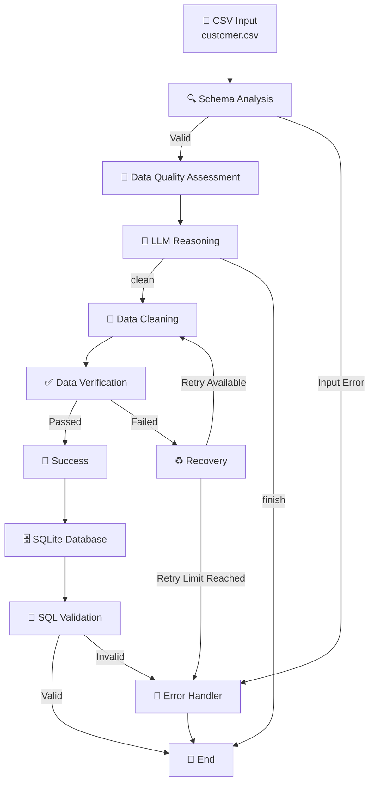

# 🤖 AI Data Engineering Agent

### Agentic Data Quality, Cleaning & Validation Pipeline

<p align="center">


</p>

---

## 🚀 Overview

> **An agentic data engineering pipeline that uses LLM reasoning to make workflow decisions while deterministic Python tools perform data processing, validation and database operations.**

The **AI Data Engineering Agent** is an AI-powered data engineering workflow that automatically analyses, validates, cleans, verifies and stores customer data.

The project combines traditional data engineering techniques with **Large Language Model (LLM) reasoning** and **LangGraph workflow orchestration**.

The system is designed around a simple principle:

> **Use AI for reasoning and deterministic engineering tools for execution.**

The LLM analyses the results of data-quality checks and decides what the pipeline should do next. Python-based tools then perform the actual data processing, cleaning, verification and database operations.

---

# 🎯 What Does This Project Do?

The agent takes a customer CSV file and processes it through an end-to-end workflow:

```text
CSV Input
    ↓
Schema Analysis
    ↓
Data Quality Assessment
    ↓
LLM Reasoning
    ↓
Decision
    ├── Finish
    │
    └── Clean
          ↓
       Cleaning
          ↓
      Verification
          ↓
    ┌─────┴─────┐
    │           │
  Passed      Failed
    │           │
    ↓           ↓
 Success     Recovery
    │           │
    ↓         Retry
 Database      │
    ↓           │
SQL Validation ┘
    ↓
   END
```
---

# ✨ Key Features

| Feature | Description |
|---|---|
| 🔍 Schema Analysis | Analyses dataset structure, columns, data types and missing values |
| 🧪 Data Quality Assessment | Detects missing values, duplicates and invalid records |
| 🧠 LLM Reasoning | Uses an LLM to determine the appropriate next processing step |
| 🔀 Conditional Routing | Uses LangGraph to route the workflow based on processing results |
| 🧹 Automated Cleaning | Cleans detected data-quality issues using deterministic Python logic |
| ✅ Data Verification | Re-validates the dataset after cleaning |
| ♻️ Recovery & Retry | Provides controlled recovery when verification fails |
| 🚨 Error Handling | Handles missing, empty and malformed input files |
| 📝 Audit Logging | Records important pipeline events and processing stages |
| 🗄️ SQLite Database | Stores validated customer records |
| 🔎 SQL Validation | Performs an additional validation after database loading |
| 🔐 Secure Configuration | Keeps API credentials outside the source code |

---

# 🧠 Why Use an LLM?

The LLM is **not responsible for directly modifying the data**.

Instead, the architecture separates **reasoning** from **execution**.

```text
                ┌───────────────────┐
                │       LLM         │
                │                   │
                │ Analyse Results   │
                │ Reason            │
                │ Make Decision     │
                └─────────┬─────────┘
                          │
                    Decision Only
                          │
                          ▼
                ┌───────────────────┐
                │    LangGraph      │
                │      Router       │
                └─────────┬─────────┘
                          │
                          ▼
              ┌────────────────────────┐
              │ Deterministic Python   │
              │ Data Engineering Tools │
              │                        │
              │ Schema                 │
              │ Quality                │
              │ Cleaning               │
              │ Verification           │
              │ Database               │
              └────────────────────────┘
```
---
This separation makes the workflow more **reproducible, testable and auditable**.

The LLM provides the reasoning layer, LangGraph controls the workflow, and Python tools perform the actual data engineering operations.

---

# 🛠️ Technology Stack

The project combines modern Python data engineering, agentic AI and database technologies.

### 🐍 Programming & Data Processing

- **Python** — Core application language
- **Pandas** — Data profiling, validation and transformation
- **SQL** — Database validation and data-quality checks
- **SQLite** — Local relational database

### 🧠 Agentic AI

- **LangGraph** — Stateful workflow orchestration and conditional routing
- **Groq** — LLM inference
- **OpenAI-compatible Python Client** — Communication with the Groq API

### ⚙️ Configuration & Reliability

- **python-dotenv** — Environment variable management
- **Python Logging** — Pipeline audit logging
- **Retry & Recovery Logic** — Controlled failure handling
- **Error Handling** — Safe handling of invalid inputs and processing failures

### 🔧 Development Tools

- **Git** — Version control
- **GitHub** — Source code management
- **VS Code** — Development environment
- **Virtual Environment** — Isolated Python dependencies

---

# 🏗️ System Architecture

The agent is implemented as a **state-driven LangGraph workflow**. Each node performs a focused data engineering responsibility, while the shared `AgentState` carries information between stages.


---

# 🔄 End-to-End Workflow

The pipeline processes the customer dataset through a sequence of validation, reasoning, transformation and storage stages.

## 1️⃣ Input Dataset

The workflow starts with the raw customer CSV:

```text
data/raw/customer.csv
```

The dataset contains fields such as:

```text
customer_id
name
email
age
country
signup_date
```

The raw input is kept separate from generated outputs so that the original dataset remains available for auditing and reprocessing.

---

## 2️⃣ Schema Analysis

The **Schema Node** examines the structure of the incoming dataset.

It identifies:

- Number of rows
- Number of columns
- Column names
- Data types
- Missing values
- Duplicate rows

The node also handles input-level failures such as:

- Missing files
- Empty datasets
- Malformed CSV files

Example schema result:

```text
Rows: 7
Columns: 6

Columns:
customer_id
name
email
age
country
signup_date
```

The result is stored in the shared `AgentState`.

---

## 3️⃣ Schema Routing

After schema analysis, LangGraph evaluates the schema status.

```text
Schema Analysis
      │
      ├── schema_complete ──► Quality Check
      │
      └── input_error ──────► Error Handler
```

This prevents invalid input from progressing through the remaining pipeline.

---

## 4️⃣ Data Quality Assessment

The **Quality Node** performs deterministic data-quality checks.

The current implementation checks:

- Missing values
- Duplicate rows
- Duplicate customer IDs
- Invalid ages
- Invalid email addresses

Example result:

```text
Missing email:          1
Missing age:            1
Duplicate rows:         1
Duplicate customer IDs: 1
Invalid age:            1
Invalid email:          1
```

These checks are performed using Python and Pandas rather than relying on the LLM.

This keeps the quality assessment deterministic and reproducible.

---

## 5️⃣ LLM Decision

The quality results are passed to the Groq-hosted LLM.

The LLM analyses the detected issues and determines the appropriate next action.

Example:

```json
{
    "decision": "clean",
    "reason": "The dataset contains missing values, duplicate entries and invalid fields that require cleaning."
}
```

The supported decisions are:

```text
clean
finish
```

The LLM provides the **reasoning layer**, but it does not directly modify the dataset.

---

## 6️⃣ Conditional Routing

LangGraph uses the LLM decision to determine the next node.

```text
             LLM Decision
                  │
          ┌───────┴───────┐
          │               │
        clean           finish
          │               │
          ▼               ▼
      Cleaning           END
```

For the sample customer dataset, the LLM identifies data-quality issues and selects:

```text
Decision: clean
```

The workflow therefore continues to the cleaning node.

---

## 7️⃣ Data Cleaning

The **Cleaning Node** uses deterministic Python logic to address the detected data-quality issues.

The current cleaning process handles:

- Duplicate rows
- Invalid ages
- Missing ages
- Missing emails

The cleaned dataset is written to:

```text
data/clean/customer_cleaned.csv
```

Example result:

```text
Original rows:           7
Final rows:              6
Duplicate rows removed:  1
Invalid ages handled:    1
Missing ages handled:    2
Missing emails handled:  1
```

---

## 8️⃣ Data Verification

The **Verification Node** runs the quality checks again against the cleaned dataset.

Expected successful result:

```text
Missing values:          0
Duplicate rows:          0
Duplicate customer IDs:  0
Invalid ages:            0
Invalid emails:          0
```

This creates a validation boundary between data transformation and downstream storage.

The data is only allowed to proceed when verification succeeds.

---

## 9️⃣ Recovery and Retry

If verification fails, the workflow enters the recovery process.

```text
Verification
      │
      ├── Passed ──► Success
      │
      └── Failed
             │
             ▼
         Recovery
             │
             ▼
        Retry Decision
             │
             ▼
          Cleaning
```

The maximum number of retries is controlled through:

```env
MAX_RETRIES=2
```

This prevents the agent from entering an infinite processing loop.

---

## 🔟 Success

When verification passes, the pipeline records a successful processing state:

```text
Dataset successfully cleaned and verified.
```

The workflow can then continue to database loading.

---

## 1️⃣1️⃣ Database Loading

The validated customer data is loaded into a SQLite database.

Database:

```text
data/database/customer.db
```

Table:

```text
customers
```

Example result:

```text
Database: data/database/customer.db
Table: customers
Rows loaded: 6
Status: success
```

The database stage provides a persistent storage layer for the validated dataset.

---

## 1️⃣2️⃣ SQL Validation

After loading the data into SQLite, the database itself is validated.

The SQL validation checks:

- Total number of rows
- Missing emails
- Invalid ages
- Duplicate customer IDs

Example:

```text
Total rows:              6
Missing emails:          0
Invalid ages:            0
Duplicate customer IDs:  0
Status:                  valid
```

This provides an additional validation layer after database loading.

---

## 1️⃣3️⃣ Final Pipeline State

When all stages complete successfully, the final state contains information from the complete workflow.

Example:

```text
status: verified_clean
retry_count: 0
```

The pipeline has therefore completed the following journey:

```text
Raw CSV
   ↓
Schema Analysis
   ↓
Quality Assessment
   ↓
LLM Reasoning
   ↓
Conditional Routing
   ↓
Data Cleaning
   ↓
Verification
   ↓
Success
   ↓
SQLite Database
   ↓
SQL Validation
   ↓
Verified Dataset
```

---
```

After that, the next README section should be **📁 Project Structure**, followed by **⚙️ Installation & Setup**, **🔐 Environment Configuration**, **▶️ Running the Agent**, **🧪 Testing & Failure Scenarios**, **📊 Example Execution**, **📝 Logging**, **🔒 Security**, **⚠️ Current Limitations**, **🚀 Future Enhancements**, **🏭 Production Recommendations**, and **🏁 Conclusion**.
