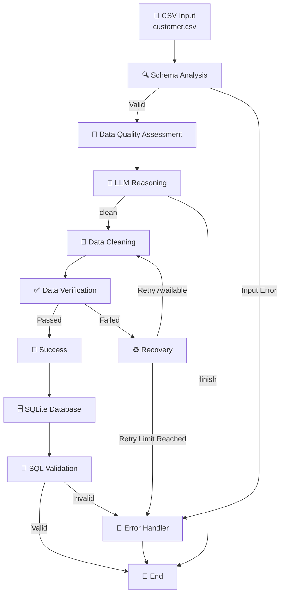

# 🤖 AI Data Engineering Agent

### Agentic Data Quality, Cleaning & Validation Pipeline

<p align="center">


</p>

---

## 🚀 Overview

> **An agentic data engineering pipeline that uses LLM reasoning to make workflow decisions while deterministic Python tools perform data processing, validation and database operations.**

The **AI Data Engineering Agent** is an AI-powered data engineering workflow that automatically analyses, validates, cleans, verifies and stores customer data.

The project combines traditional data engineering techniques with **Large Language Model (LLM) reasoning** and **LangGraph workflow orchestration**.

The system is designed around a simple principle:

> **Use AI for reasoning and deterministic engineering tools for execution.**

The LLM analyses the results of data-quality checks and decides what the pipeline should do next. Python-based tools then perform the actual data processing, cleaning, verification and database operations.

---

# 🎯 What Does This Project Do?

The agent takes a customer CSV file and processes it through an end-to-end workflow:

```text
CSV Input
    ↓
Schema Analysis
    ↓
Data Quality Assessment
    ↓
LLM Reasoning
    ↓
Decision
    ├── Finish
    │
    └── Clean
          ↓
       Cleaning
          ↓
      Verification
          ↓
    ┌─────┴─────┐
    │           │
  Passed      Failed
    │           │
    ↓           ↓
 Success     Recovery
    │           │
    ↓         Retry
 Database      │
    ↓           │
SQL Validation ┘
    ↓
   END
```

---

# ✨ Key Features

| Feature | Description |
|---|---|
| 🔍 Schema Analysis | Analyses dataset structure, columns, data types and missing values |
| 🧪 Data Quality Assessment | Detects missing values, duplicates and invalid records |
| 🧠 LLM Reasoning | Uses an LLM to determine the appropriate next processing step |
| 🔀 Conditional Routing | Uses LangGraph to route the workflow based on processing results |
| 🧹 Automated Cleaning | Cleans detected data-quality issues using deterministic Python logic |
| ✅ Data Verification | Re-validates the dataset after cleaning |
| ♻️ Recovery & Retry | Provides controlled recovery when verification fails |
| 🚨 Error Handling | Handles missing, empty and malformed input files |
| 📝 Audit Logging | Records important pipeline events and processing stages |
| 🗄️ SQLite Database | Stores validated customer records |
| 🔎 SQL Validation | Performs an additional validation after database loading |
| 🔐 Secure Configuration | Keeps API credentials outside the source code |

---

# 🧠 Why Use an LLM?

The LLM is **not responsible for directly modifying the data**.

Instead, the architecture separates **reasoning** from **execution**.

```text
                ┌───────────────────┐
                │       LLM         │
                │                   │
                │ Analyse Results   │
                │ Reason            │
                │ Make Decision     │
                └─────────┬─────────┘
                          │
                    Decision Only
                          │
                          ▼
                ┌───────────────────┐
                │    LangGraph      │
                │      Router       │
                └─────────┬─────────┘
                          │
                          ▼
              ┌────────────────────────┐
              │ Deterministic Python   │
              │ Data Engineering Tools │
              │                        │
              │ Schema                 │
              │ Quality                │
              │ Cleaning               │
              │ Verification           │
              │ Database               │
              └────────────────────────┘
```

This separation makes the workflow more **reproducible, testable and auditable**.

The LLM provides the reasoning layer, LangGraph controls the workflow, and Python tools perform the actual data engineering operations.

---

# 🛠️ Technology Stack

The project combines modern Python data engineering, agentic AI and database technologies.

### 🐍 Programming & Data Processing

- **Python** — Core application language
- **Pandas** — Data profiling, validation and transformation
- **SQL** — Database validation and data-quality checks
- **SQLite** — Local relational database

### 🧠 Agentic AI

- **LangGraph** — Stateful workflow orchestration and conditional routing
- **Groq** — LLM inference
- **OpenAI-compatible Python Client** — Communication with the Groq API

### ⚙️ Configuration & Reliability

- **python-dotenv** — Environment variable management
- **Python Logging** — Pipeline audit logging
- **Retry & Recovery Logic** — Controlled failure handling
- **Error Handling** — Safe handling of invalid inputs and processing failures

### 🔧 Development Tools

- **Git** — Version control
- **GitHub** — Source code management
- **VS Code** — Development environment
- **Virtual Environment** — Isolated Python dependencies

---

# 🏗️ System Architecture

The agent is implemented as a **state-driven LangGraph workflow**. Each node performs a focused data engineering responsibility, while the shared `AgentState` carries information between stages.



### 🔄 Workflow Decision Points

```text
Schema Analysis
      │
      ├── Input Error ──────────────► Error Handler
      │
      └── Valid
            │
            ▼
      Quality Assessment
            │
            ▼
       LLM Reasoning
            │
       ┌────┴────┐
       │         │
     clean     finish
       │         │
       ▼         ▼
   Cleaning     END
       │
       ▼
   Verification
       │
    ┌──┴──┐
    │     │
 Passed  Failed
    │     │
    ▼     ▼
 Success Recovery
    │     │
    ▼     └──► Retry ──► Cleaning
 Database
    │
    ▼
SQL Validation
    │
    ▼
   END
```

---

# 🔄 End-to-End Workflow

The pipeline processes the customer dataset through a sequence of validation, reasoning, transformation and storage stages.

## 1️⃣ Input Dataset

The workflow starts with the raw customer CSV:

```text
data/raw/customer.csv
```

The dataset contains fields such as:

```text
customer_id
name
email
age
country
signup_date
```

The raw input is kept separate from generated outputs so that the original dataset remains available for auditing and reprocessing.

---

## 2️⃣ Schema Analysis

The **Schema Node** examines the structure of the incoming dataset.

It identifies:

- Number of rows
- Number of columns
- Column names
- Data types
- Missing values
- Duplicate rows

The node also handles input-level failures such as:

- Missing files
- Empty datasets
- Malformed CSV files

Example schema result:

```text
Rows: 7
Columns: 6

Columns:
customer_id
name
email
age
country
signup_date
```

The result is stored in the shared `AgentState`.

---

## 3️⃣ Schema Routing

After schema analysis, LangGraph evaluates the schema status.

```text
Schema Analysis
      │
      ├── schema_complete ──► Quality Check
      │
      └── input_error ──────► Error Handler
```

This prevents invalid input from progressing through the remaining pipeline.

---

## 4️⃣ Data Quality Assessment

The **Quality Node** performs deterministic data-quality checks.

The current implementation checks:

- Missing values
- Duplicate rows
- Duplicate customer IDs
- Invalid ages
- Invalid email addresses

Example result:

```text
Missing email:          1
Missing age:            1
Duplicate rows:         1
Duplicate customer IDs: 1
Invalid age:            1
Invalid email:          1
```

These checks are performed using Python and Pandas rather than relying on the LLM.

This keeps the quality assessment deterministic and reproducible.

---

## 5️⃣ LLM Decision

The quality results are passed to the Groq-hosted LLM.

The LLM analyses the detected issues and determines the appropriate next action.

Example:

```json
{
    "decision": "clean",
    "reason": "The dataset contains missing values, duplicate entries and invalid fields that require cleaning."
}
```

The supported decisions are:

```text
clean
finish
```

The LLM provides the **reasoning layer**, but it does not directly modify the dataset.

---

## 6️⃣ Conditional Routing

LangGraph uses the LLM decision to determine the next node.

```text
             LLM Decision
                  │
          ┌───────┴───────┐
          │               │
        clean           finish
          │               │
          ▼               ▼
      Cleaning           END
```

For the sample customer dataset, the LLM identifies data-quality issues and selects:

```text
Decision: clean
```

The workflow therefore continues to the cleaning node.

---

## 7️⃣ Data Cleaning

The **Cleaning Node** uses deterministic Python logic to address the detected data-quality issues.

The current cleaning process handles:

- Duplicate rows
- Invalid ages
- Missing ages
- Missing emails

The cleaned dataset is written to:

```text
data/clean/customer_cleaned.csv
```

Example result:

```text
Original rows:           7
Final rows:              6
Duplicate rows removed:  1
Invalid ages handled:    1
Missing ages handled:    2
Missing emails handled:  1
```

---

## 8️⃣ Data Verification

The **Verification Node** runs the quality checks again against the cleaned dataset.

Expected successful result:

```text
Missing values:          0
Duplicate rows:          0
Duplicate customer IDs:  0
Invalid ages:            0
Invalid emails:          0
```

This creates a validation boundary between data transformation and downstream storage.

The data is only allowed to proceed when verification succeeds.

---

## 9️⃣ Recovery and Retry

If verification fails, the workflow enters the recovery process.

```text
Verification
      │
      ├── Passed ──► Success
      │
      └── Failed
             │
             ▼
         Recovery
             │
             ▼
        Retry Decision
             │
             ▼
          Cleaning
```

The maximum number of retries is controlled through:

```env
MAX_RETRIES=2
```

This prevents the agent from entering an infinite processing loop.

---

## 🔟 Success

When verification passes, the pipeline records a successful processing state:

```text
Dataset successfully cleaned and verified.
```

The workflow can then continue to database loading.

---

## 1️⃣1️⃣ Database Loading

The validated customer data is loaded into a SQLite database.

Database:

```text
data/database/customer.db
```

Table:

```text
customers
```

Example result:

```text
Database: data/database/customer.db
Table: customers
Rows loaded: 6
Status: success
```

The database stage provides a persistent storage layer for the validated dataset.

---

## 1️⃣2️⃣ SQL Validation

After loading the data into SQLite, the database itself is validated.

The SQL validation checks:

- Total number of rows
- Missing emails
- Invalid ages
- Duplicate customer IDs

Example:

```text
Total rows:              6
Missing emails:          0
Invalid ages:            0
Duplicate customer IDs:  0
Status:                  valid
```

This provides an additional validation layer after database loading.

---

## 1️⃣3️⃣ Final Pipeline State

When all stages complete successfully, the final state contains information from the complete workflow.

Example:

```text
status: verified_clean
retry_count: 0
```

The pipeline has therefore completed the following journey:

```text
Raw CSV
   ↓
Schema Analysis
   ↓
Quality Assessment
   ↓
LLM Reasoning
   ↓
Conditional Routing
   ↓
Data Cleaning
   ↓
Verification
   ↓
Success
   ↓
SQLite Database
   ↓
SQL Validation
   ↓
Verified Dataset
```

---

# 📁 Project Structure

The project follows a modular architecture that separates workflow orchestration, data engineering tools, configuration, logging and data storage.

```text
ai-data-engineering/
│
├── app/
│   │
│   ├── agents/
│   │   ├── __init__.py
│   │   ├── langgraph_agent.py
│   │   ├── state.py
│   │   ├── schema_agent.py
│   │   ├── llm_test.py
│   │   └── tool_call_test.py
│   │
│   ├── tools/
│   │   ├── __init__.py
│   │   ├── schema_tool.py
│   │   ├── quality_tool.py
│   │   ├── cleaning_tool.py
│   │   └── database_tool.py
│   │
│   ├── config.py
│   ├── logger.py
│   └── __init__.py
│
├── data/
│   └── raw/
│       └── customer.csv
│
├── .env.example
├── .gitignore
├── README.md
└── requirements.txt
```

## 📦 Core Components

| Component | Responsibility |
|---|---|
| `langgraph_agent.py` | Defines and executes the LangGraph workflow |
| `state.py` | Defines the shared `AgentState` used across workflow nodes |
| `schema_agent.py` | Handles schema analysis and input validation |
| `schema_tool.py` | Performs dataset structure and schema inspection |
| `quality_tool.py` | Performs deterministic data-quality checks |
| `cleaning_tool.py` | Cleans detected data-quality issues |
| `database_tool.py` | Loads validated data into SQLite and performs SQL validation |
| `config.py` | Centralises environment-based application configuration |
| `logger.py` | Provides application logging and audit events |
| `requirements.txt` | Defines the Python dependencies required by the project |
| `.env.example` | Provides a safe environment configuration template |

---

# ⚙️ Installation & Setup

Follow the steps below to run the AI Data Engineering Agent locally.

## 1️⃣ Clone the Repository

```bash
git clone https://github.com/Sunil43-DA/agentic-ai-data-engineering.git
cd agentic-ai-data-engineering
```

---

## 2️⃣ Create a Virtual Environment

Creating a virtual environment keeps the project dependencies isolated from the system Python installation.

### Windows

```bash
python -m venv .venv
```

### Activate the Environment

For Windows Command Prompt:

```cmd
.venv\Scripts\activate
```

For Windows PowerShell:

```powershell
.venv\Scripts\Activate.ps1
```

After activation, the terminal should display:

```text
(.venv)
```

---

## 3️⃣ Install Dependencies

Install the required project dependencies:

```bash
pip install -r requirements.txt
```

---

# 🔐 Environment Configuration

Create a local `.env` file in the project root.

Use the following configuration:

```env
GROQ_API_KEY=your_groq_api_key_here
GROQ_BASE_URL=https://api.groq.com/openai/v1
GROQ_MODEL=openai/gpt-oss-20b

INPUT_FILE=data/raw/customer.csv
CLEANED_FILE=data/clean/customer_cleaned.csv

MAX_RETRIES=2
```

| Variable | Purpose |
|---|---|
| `GROQ_API_KEY` | Groq API authentication |
| `GROQ_BASE_URL` | Groq API endpoint |
| `GROQ_MODEL` | LLM model used by the agent |
| `INPUT_FILE` | Raw customer CSV path |
| `CLEANED_FILE` | Cleaned customer CSV path |
| `MAX_RETRIES` | Maximum recovery attempts |

> **Security:** Never commit your real `.env` file or API key to GitHub. Use `.env.example` as the configuration template.

---

# 📄 Input Dataset

Default input file:

```text
data/raw/customer.csv
```

Expected columns:

```text
customer_id
name
email
age
country
signup_date
```

---

# ▶️ Running the Agent

From the project root, run:

```bash
python -m app.agents.langgraph_agent
```

The complete pipeline executes:

```text
CSV Input
    ↓
Schema Analysis
    ↓
Data Quality Assessment
    ↓
LLM Reasoning
    ↓
Conditional Routing
    ↓
Data Cleaning
    ↓
Verification
    ↓
Database Loading
    ↓
SQL Validation
    ↓
Final State
```

---

# 🧪 Testing & Failure Handling

The pipeline has been tested using normal and invalid input scenarios.

## ✅ Test 1 — Normal Customer Dataset

Input:

```text
data/raw/customer.csv
```

Detected issues included:

```text
Missing email
Missing age
Duplicate rows
Duplicate customer IDs
Invalid age
Invalid email
```

The LLM selected:

```text
Decision: clean
```

Cleaning result:

```text
Original rows:           7
Final rows:              6
Duplicate rows removed:  1
Invalid ages handled:    1
Missing ages handled:    2
Missing emails handled:  1
```

---

## 🚨 Test 2 — Missing Input File

Test file:

```text
data/raw/customer_missing_test.csv
```

Result:

```text
File not found: data/raw/customer_missing_test.csv
```

The pipeline routed the failure to the error handler and stopped safely.

---

## 🚨 Test 3 — Malformed CSV

Test file:

```text
data/raw/customer_malformed_test.csv
```

Result:

```text
Error tokenizing data.
Expected 6 fields in line 4, saw 7
```

The pipeline detected the schema error and stopped safely.

---

## 🚨 Test 4 — Empty Dataset

Test file:

```text
data/raw/customer_empty_test.csv
```

Result:

```text
Dataset is empty. The CSV contains no data rows.
```

The pipeline routed the failure to the error handler.

---

## ✅ Test 5 — Data Verification

After cleaning, the dataset was verified successfully:

```text
Missing values:          0
Duplicate rows:          0
Duplicate customer IDs:  0
Invalid ages:            0
Invalid emails:          0
```

---

## 🗄️ Test 6 — Database Loading

Validated data was successfully loaded into SQLite:

```text
Database: data/database/customer.db
Table: customers
Rows loaded: 6
Status: success
```

---

## 🔎 Test 7 — SQL Validation

The database validation returned:

```text
Total rows:              6
Missing emails:          0
Invalid ages:            0
Duplicate customer IDs:  0
Status:                  valid
```

---

# 📊 Example Successful Execution

```text
========================================
      AI DATA ENGINEERING AGENT
========================================

===== SCHEMA NODE =====
Schema analysis completed

===== QUALITY NODE =====
Data quality assessment completed

===== LLM DECISION =====
Decision: clean

===== CLEANING NODE =====
Data cleaning completed

===== VERIFICATION NODE =====
Data verification completed

===== DATABASE NODE =====
Database loading completed

===== DATABASE SQL VALIDATION =====
SQL validation passed

===== SUCCESS NODE =====
Dataset successfully cleaned and verified.
```

---

# 📝 Logging & Audit Trail

The application records important pipeline events through the logging layer.

Typical events include:

```text
schema
quality
llm
cleaning
verification
database
pipeline
```

The logs provide visibility into pipeline execution and support troubleshooting.

---

# ♻️ Recovery & Retry

The retry limit is configured through:

```env
MAX_RETRIES=2
```

The recovery flow is:

```text
Verification
      │
      ├── Passed ──► Database
      │
      └── Failed
             │
             ▼
          Recovery
             │
             ▼
       Retry Available?
          /        \
        Yes         No
         │           │
         ▼           ▼
     Cleaning     Error Handler
```

---

# 🧩 Design Principles

- **LLM for reasoning** — The model makes workflow decisions.
- **Python for execution** — Deterministic tools perform data operations.
- **Validation before progression** — Data is verified before downstream processing.
- **Fail-fast behaviour** — Invalid input is stopped early.
- **Controlled retries** — Retry limits prevent infinite processing loops.
- **Modular design** — Each pipeline responsibility is separated into components.
- **Secure configuration** — Credentials remain outside the source code.

---

# ⚠️ Current Limitations

- CSV is currently the primary input format.
- SQLite is used for local database storage.
- Cleaning rules are focused on the current customer dataset.
- The workflow currently runs locally.
- No distributed processing layer is currently implemented.
- No cloud deployment is currently configured.
- Monitoring is currently based on application logging.

---

# 🚀 Future Enhancements

Potential future improvements include:

- ☁️ Cloud storage integration
- ⚡ PySpark and distributed processing
- 🏢 Snowflake or Databricks integration
- 📊 Data-quality dashboards
- 🔍 Schema-drift detection
- 🤖 Advanced agentic tool selection
- 📈 Data-quality scoring
- 🚨 Automated alerts
- 🔄 Production orchestration
- 🐳 Docker containerisation
- 🔁 CI/CD automation
- ☁️ Cloud deployment
- 🔐 Managed secret storage
- 📡 Centralised monitoring

---

# 🏭 Production Recommendations

| Area | Current | Production |
|---|---|---|
| Input | CSV | Cloud object storage |
| Processing | Pandas | Spark / Databricks |
| Database | SQLite | Cloud database / warehouse |
| Secrets | `.env` | Secret Manager / Key Vault |
| Logging | Local logging | Centralised observability |
| Testing | Manual scenarios | Automated CI/CD |
| Deployment | Local | Docker / Cloud |
| Monitoring | Logs | Metrics, alerts and dashboards |

---

# 🔐 Security

The project follows basic secure-development practices:

- `.env` is excluded from Git.
- `.env.example` contains placeholders only.
- API credentials are not stored in source code.
- Invalid input is rejected before downstream processing.
- Retry limits prevent uncontrolled execution.

For production, managed secrets, access controls, encryption and centralised security monitoring should be added.

---

# 🧪 Testing Strategy

The project should be tested at three levels.

### Unit Testing

Individual tools:

```text
Schema Tool
Quality Tool
Cleaning Tool
Database Tool
```

### Integration Testing

```text
Schema
   ↓
Quality
   ↓
LLM
   ↓
Cleaning
   ↓
Verification
```

### End-to-End Testing

```text
Input
  ↓
Processing
  ↓
Verification
  ↓
Database
  ↓
SQL Validation
```

---

# 📌 Key Learning Outcomes

This project demonstrates practical implementation of:

- Python data engineering
- Pandas data processing
- Data-quality validation
- Data cleaning
- SQL validation
- SQLite database loading
- LLM integration
- LangGraph workflows
- Conditional routing
- Error handling
- Retry and recovery
- Application logging
- Environment configuration
- Git and GitHub version control

---

# 🏁 Conclusion

The AI Data Engineering Agent combines **agentic AI reasoning with deterministic data engineering execution**.

The LLM determines the appropriate workflow decision, while Python tools perform the actual data processing, validation, cleaning and database operations.

The current implementation provides a foundation that can later be extended into a cloud-based, production-grade data-quality and data-engineering platform.

---

# 📊 Project Status

| Component | Status |
|---|---|
| Schema Analysis | ✅ Complete |
| Data Quality Checks | ✅ Complete |
| LLM Reasoning | ✅ Complete |
| Conditional Routing | ✅ Complete |
| Data Cleaning | ✅ Complete |
| Data Verification | ✅ Complete |
| Recovery Logic | ✅ Implemented |
| SQLite Loading | ✅ Complete |
| SQL Validation | ✅ Complete |
| Error Handling | ✅ Tested |
| Audit Logging | ✅ Implemented |
| Configuration Management | ✅ Implemented |
| GitHub Version Control | ✅ Implemented |

---

# 👨‍💻 Author

## Sunil Narayanareddy

**Data Engineer | AI & Data Engineering**

Areas of interest:

- Data Engineering
- Cloud Data Platforms
- AI Engineering
- Agentic AI
- Data Quality
- Analytics Engineering
- Data Platform Development

---

# ⭐ Support the Project

If you find this project useful, consider giving the repository a ⭐ on GitHub.

---

# 📄 License

This project is available under the license included in the repository.

